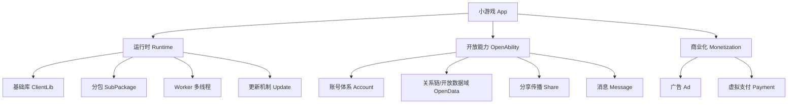
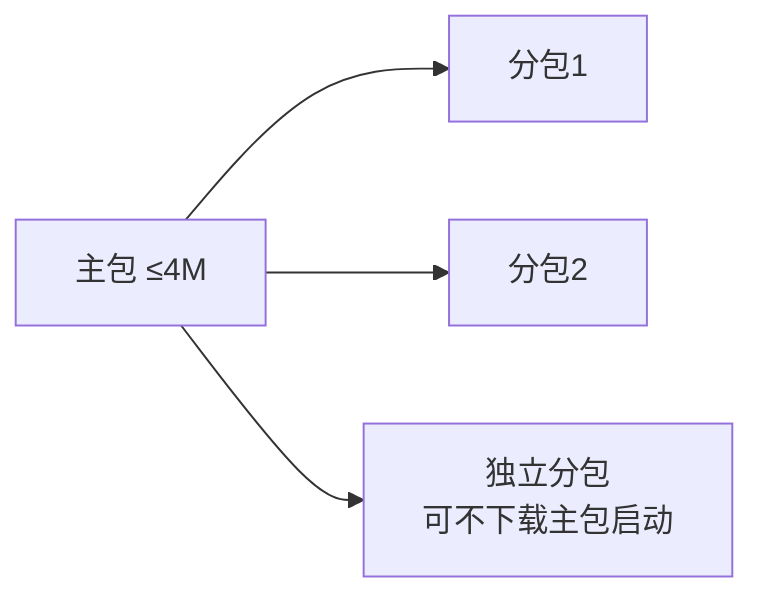
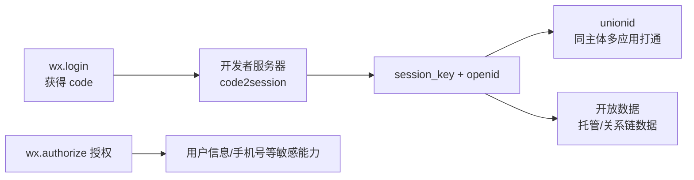
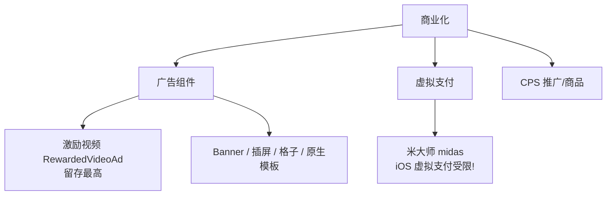
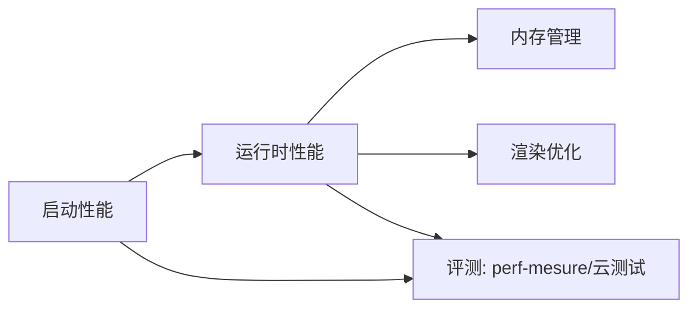

# 概念关系图谱

微信小游戏开发的核心概念及其相互关系。用于快速建立全局认知、理解能力之间的依赖。

## 顶层视图



## 1. 运行时架构

小游戏的代码运行在**逻辑层**（JsCore/V8），通过 Canvas 渲染。与传统网页不同，没有 DOM/BOM，BOM API 由微信客户端模拟提供。

- **运行环境**：[guide/runtime/env.md](guide/runtime/env.md) — 各端 JsCore 差异
- **适配层 Adapter**：[guide/runtime/adapter.md](guide/runtime/adapter.md) — 模拟浏览器 API，引擎适配的基础
- **运行机制**：[guide/runtime/operating-mechanism.md](guide/runtime/operating-mechanism.md) — 前台/后台、冷启动/热启动、销毁时机
- **JS 支持情况**：[guide/runtime/js-support.md](guide/runtime/js-support.md)
- **基础库与兼容性**：[guide/runtime/client-lib/compatibility.md](guide/runtime/client-lib/compatibility.md) — 几乎所有 API 文档中"基础库 x.x.x 开始支持"的兼容处理方法
- **模块化**：[guide/base-ability/module.md](guide/base-ability/module.md) — CommonJS 模块规范

### 生命周期（时序）

```
冷启动: wx.getLaunchOptionsSync → wx.onShow → (游戏运行) → wx.onHide
热启动: wx.onShow (携带 wx.getEnterOptionsSync 参数)
```

- 生命周期 API：[api/base/life-cycle/](api/base/life-cycle/README.md)
- 应用级事件（内存告警、音频中断等）：[api/base/app-event/](api/base/app-event/README.md)
- **场景值**（用户从哪进入）：[guide/base-ability/scene.md](guide/base-ability/scene.md)

### 分包与代码包



- 代码包限制与规范：[guide/base-ability/code-package.md](guide/base-ability/code-package.md)
- 分包加载指南：[guide/base-ability/subPackage/](guide/base-ability/subpackage/) → API：[api/base/subpackage/](api/base/subpackage/README.md)
- 独立分包：[guide/base-ability/independent-sub-packages.md](guide/base-ability/independent-sub-packages.md)
- 分包预下载（启动优化）：[guide/performance/startup/predownload-of-minigame-packages.md](guide/performance/startup/predownload-of-minigame-packages.md)

### Worker 多线程

- 指南：[guide/base-ability/workers.md](guide/base-ability/workers.md)、[guide/base-ability/new-worker.md](guide/base-ability/new-worker.md)
- API：[api/worker/](api/worker/README.md)（`wx.createWorker` → `Worker` 对象）
- 用途：把 AI 计算、物理模拟等重计算移出主线程，配合[性能-运行时](guide/performance/runtime/perf-action-cpu-worker.md)

## 2. 账号与用户体系



- **登录流程**（核心中的核心）：
  - 指南：[guide/open-ability/account/login.md](guide/open-ability/account/login.md)
  - API：[wx.login](api/open/login/wx.login.md)、[wx.checkSession](api/open/login/wx.checkSession.md)
  - 后端接口：[guide/base-ability/backend-api.md](guide/base-ability/backend-api.md)
- **UnionID 机制**：[guide/open-ability/account/union-id.md](guide/open-ability/account/union-id.md)
- **用户信息**：新旧接口变迁很大 — [guide/open-ability/account/user-info.md](guide/open-ability/account/user-info.md)，API [api/open/user-info/](api/open/user-info/README.md)
- **手机号获取**：[guide/open-ability/account/getPhoneNumber.md](guide/open-ability/account/getPhoneNumber.md)、[getRealtimePhoneNumber](guide/open-ability/account/getRealtimePhoneNumber.md)
- **授权机制总览**：[guide/base-ability/authorize.md](guide/base-ability/authorize.md)，API [api/open/authorize/](api/open/authorize/README.md)、[api/open/setting/](api/open/setting/README.md)
- **隐私授权**：[guide/open-ability/account/privacy.md](guide/open-ability/account/privacy.md)，API [api/open/privacy/](api/open/privacy/README.md)

## 3. 开放数据域与关系链

小游戏保护用户关系链的方式：**开放数据域**是一个独立运行的封闭 JS 环境，只能获取数据、绘制到共享 Canvas，**不能向外发网络请求**。

- 概念与配置：[guide/open-ability/data/open-data.md](guide/open-ability/data/open-data.md)、[guide/open-ability/data/opendata/](guide/open-ability/data/opendata/README.md)
- 主域 ↔ 开放数据域通信：`wx.getOpenDataContext` → `OpenDataContext.postMessage`
- 相关 API：[api/open/data/](api/open/data/README.md)（24 篇，含 `wx.setUserCloudStorage` 托管数据、`wx.getFriendCloudStorage` 好友数据）
- 典型应用 — **排行榜**：[guide/open-ability/data/ranklist.md](guide/open-ability/data/ranklist.md)
- 互动型托管数据（点赞/送礼）：[guide/open-ability/data/interactive-data.md](guide/open-ability/data/interactive-data.md)
- 开放数据域项目配置：`game.json` 的 `openDataContext` 字段，见[配置](guide/getting-started/configuration.md)

## 4. 分享与社交传播

- 被动分享（右上角菜单）与主动分享（`wx.shareAppMessage`）：[guide/open-ability/share/](guide/open-ability/share/README.md)，API [api/share/](api/share/README.md)（23 篇）
- 分享图片规范与 `wx.shareAppMessage` 的 imageUrl 要求
- 获取 shareTicket → 群排行：[wx.getShareInfo](api/share/wx.getShareInfo.md)（关联[群组](api/open/group/)）
- 分享到朋友圈：[guide/open-ability/share/share-timeline_game.md](guide/open-ability/share/share-timeline_game.md)
- 定向分享：[guide/open-ability/share/share-to-specific-friend.md](guide/open-ability/share/share-to-specific-friend.md)
- 分享礼物：[guide/open-ability/share/share-gift.md](guide/open-ability/share/share-gift.md)

## 5. 商业化



- 广告接入指南：[guide/open-ability/ad/](guide/open-ability/ad/README.md)；广告 API 全集：[api/ad/](api/ad/README.md)（64 篇，每种广告组件一套 创建/加载/展示/事件 接口）
- 商业化运营（流量主、买量）：[guide/open-ability/growth/commercialization/](guide/open-ability/growth/commercialization/README.md)
- **虚拟支付（强平台规则）**：[guide/open-ability/payment/](guide/open-ability/payment/README.md)，API [api/midas-payment/](api/midas-payment/README.md)。⚠️ iOS 端虚拟支付受苹果规则限制，接入前必读指南
- 试玩广告（Playable）：[guide/open-ability/playable/](guide/open-ability/playable/README.md)
- CPS/商品推荐：[guide/open-ability/growth/cps-recommend.md](guide/open-ability/growth/cps-recommend.md)

## 6. 消息与触达

- 订阅消息（一次性/长期）：[guide/open-ability/message/subscribe-message.md](guide/open-ability/message/subscribe-message.md)，API [api/open/subscribe-message/](api/open/subscribe-message/README.md)
- 系统订阅消息（排行超越提醒等）：[guide/open-ability/message/subscribe-system-message.md](guide/open-ability/message/subscribe-system-message.md)
- 游戏更新提醒：[guide/open-ability/message/subscribe-update-notification-message.md](guide/open-ability/message/subscribe-update-notification-message.md)
- 客服消息：[guide/open-ability/community/customer-message/](guide/open-ability/community/customer-message/README.md)

## 7. 社区与玩法能力

- **游戏圈**（内容社区）：[guide/open-ability/community/game-club.md](guide/open-ability/community/game-club.md)，API [api/open/game-club/](api/open/game-club/README.md)
- **游戏录屏与对局回放**：指南 [guide/open-ability/gameplay/game-recorder.md](guide/open-ability/gameplay/game-recorder.md)，API [api/game-recorder/](api/game-recorder/README.md)
- **房间对战**（实时对战/帧同步）：
  - 房间服务：[guide/open-ability/gameplay/roomservice.md](guide/open-ability/gameplay/roomservice.md)
  - 帧同步：[guide/open-ability/gameplay/lock-step.md](guide/open-ability/gameplay/lock-step.md)
  - 匹配：[guide/open-ability/gameplay/gamematch.md](guide/open-ability/gameplay/gamematch.md)
  - 对局服务器（MGOBE 类）：API [api/game-server-manager/](api/game-server-manager/README.md)（54 篇）
- 实时语音：[guide/open-ability/gameplay/voip-chat.md](guide/open-ability/gameplay/voip-chat.md)，API [api/media/voip/](api/media/voip/README.md)
- 聊天工具 API：[api/chattool/](api/chattool/README.md)
- 视频号联动（直播/活动/主页）：[guide/open-ability/channels/](guide/open-ability/channels/README.md)

## 8. 性能优化体系

官方性能文档分两条线：**优化方法论**（guide/performance/）与 **性能 API**（api/base/performance/、wx 性能相关接口）。



- 总览与评测标准：[guide/performance/overview/](guide/performance/overview/README.md)
- 启动优化（首包、预下载、并行下载、启动上报）：[guide/performance/startup/](guide/performance/startup/README.md)
- 内存（GC、Profile、云真机）：[guide/performance/memory/](guide/performance/memory/README.md)
- 渲染（纹理压缩、绑定优化）：[guide/performance/render/](guide/performance/render/README.md)
- 工具（PerfDog、云测试、性能面板）：[guide/performance/tools/](guide/performance/tools/README.md)、[guide/performance/perf-audit/](guide/performance/perf-audit/README.md)
- 性能 API：[api/base/performance/](api/base/performance/README.md)（`wx.getPerformance`、`PerformanceEntry` 等）

## 9. 游戏引擎适配

- 引擎总览与选择：[guide/engine/engine-overview.md](guide/engine/engine-overview.md)
- **Unity WebGL 转化**（63 篇，最大的一块）：
  - 入门转化流程：[guide/engine/unity/getting-started/](guide/engine/unity/getting-started/README.md)（Guide → Transform → WX_SDK）
  - 启动优化：[guide/engine/unity/startup/](guide/engine/unity/startup/README.md)
  - 资源管理（Addressable/AssetBundle/WasmSplit/首包）：[guide/engine/unity/assets/](guide/engine/unity/assets/README.md)
  - 性能与渲染：[guide/engine/unity/performance/](guide/engine/unity/performance/README.md)、[guide/engine/unity/rendering/](guide/engine/unity/rendering/README.md)
- **Cocos/Laya/Egret 等**：通用适配层方案 [guide/engine/common-adaptation/](guide/engine/common-adaptation/README.md)（QuickStart → 各 Adapter：FileSystem/Http/Socket/WebSocket）
- 引擎插件（减小包体）：[guide/base-ability/game-engine-plugin.md](guide/base-ability/game-engine-plugin.md)

## 10. 安全与合规

- 内容安全（UGC 检测）：[guide/security/security.md](guide/security/security.md)
- 安全风控接口：[guide/security/risk-control.md](guide/security/risk-control.md)
- 反作弊：[guide/security/antiadcheat.md](guide/security/antiadcheat.md)
- 数据签名/加密：开放数据签名校验 [guide/open-ability/data/signature.md](guide/open-ability/data/signature.md)，加密 API [api/base/crypto/](api/base/crypto/README.md)

## 常见任务速查

| 我想… | 入口 |
|---|---|
| 实现微信登录 | [topics/login-and-user.md](topics/login-and-user.md) |
| 做好友排行榜 | [topics/open-data-ranklist.md](topics/open-data-ranklist.md) |
| 接激励视频广告 | [topics/ads-monetization.md](topics/ads-monetization.md) |
| 接虚拟支付 | [topics/virtual-payment.md](topics/virtual-payment.md) |
| 做分享裂变 | [topics/share-growth.md](topics/share-growth.md) |
| Unity 项目转小游戏 | [topics/unity-transform.md](topics/unity-transform.md) |
| 优化启动速度/包体 | [topics/subpackage-startup.md](topics/subpackage-startup.md) |
| 做多人实时对战 | [topics/multiplayer.md](topics/multiplayer.md) |
| 排查性能问题 | [topics/performance.md](topics/performance.md) |
| 存储与网络选型 | [topics/storage-network.md](topics/storage-network.md) |
| 发布上线与版本更新 | [topics/release-update.md](topics/release-update.md) |
| 多平台（PC/鸿蒙）适配 | [topics/multi-platform.md](topics/multi-platform.md) |
